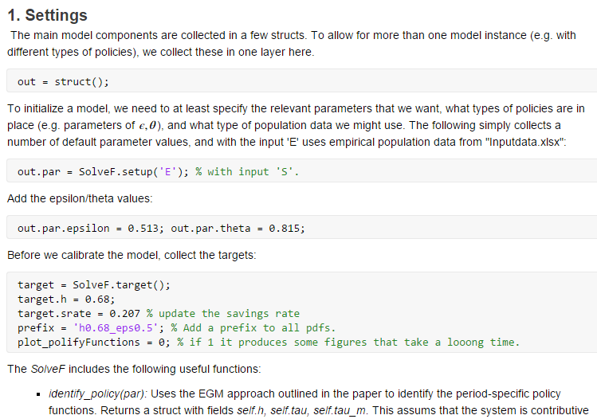

# SocialSecurityDesign
Code repository for the paper "Social Security Design and its Political Support". Programs are written in Matlab (R2018b) and runs as is (no specific dependencies). The Live Script ```EGM.mlx``` contains the main steps for producing quantitative results. 

## Results for Argentina:

The code for the Argentina case runs as follows:
1. The file ```Inputdata.xlsx``` contains data on $\nu_t$ in the worksheet "PopulationData". 
2. The file ```EGM.mlx``` runs the main simulations:

 * The targets for the calibration are defined in the settings section - in the struct ```target```. In the following example, we create a "standard" instance of the target struct and then adjusts some of the targets (savings rate 2010 and labor supply in 1980):
  

 * The file calibrates the model, stores the parameters in ```ArgentinaTargets.mat``` and ```ArgentinaParameters.mat``` to be used in other programs, runs the counterfactual exercise of changing to universal pension benefits, and prints a number of figures used in the paper.

3. The file ```PolarCases.mxl``` runs simulations *given* parameter values from ```EGM.mlx```. The main output from this program is the ```input``` struct that contains differences between various polar policy regimes. 
4. The file ```InfiniteHorizon.mxl``` runs simulations *given* parameter values from ```EGM.mlx```. This file compares three ways of solving the model: 

* The time-dependent solution with finite horizon,
* the time-dependent solution with infinite horizon,
* the steady state approximation. *NB: This takes a lot of time to run. The calibration proces is numerically pretty unstable as well. Thus, for changed targets in the calibration, it may not find a solution. We should work in a gradient-free solver here + add an initial gridsearch to make sure that a solution can be found.*
